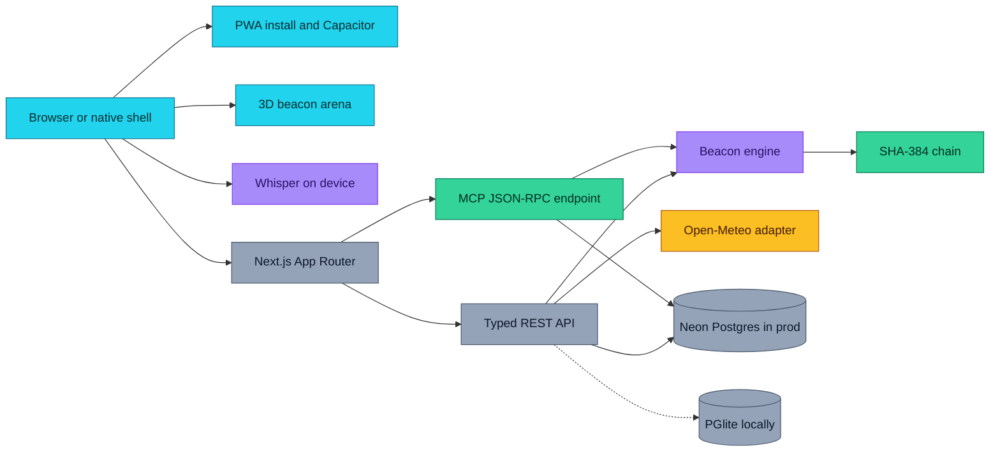
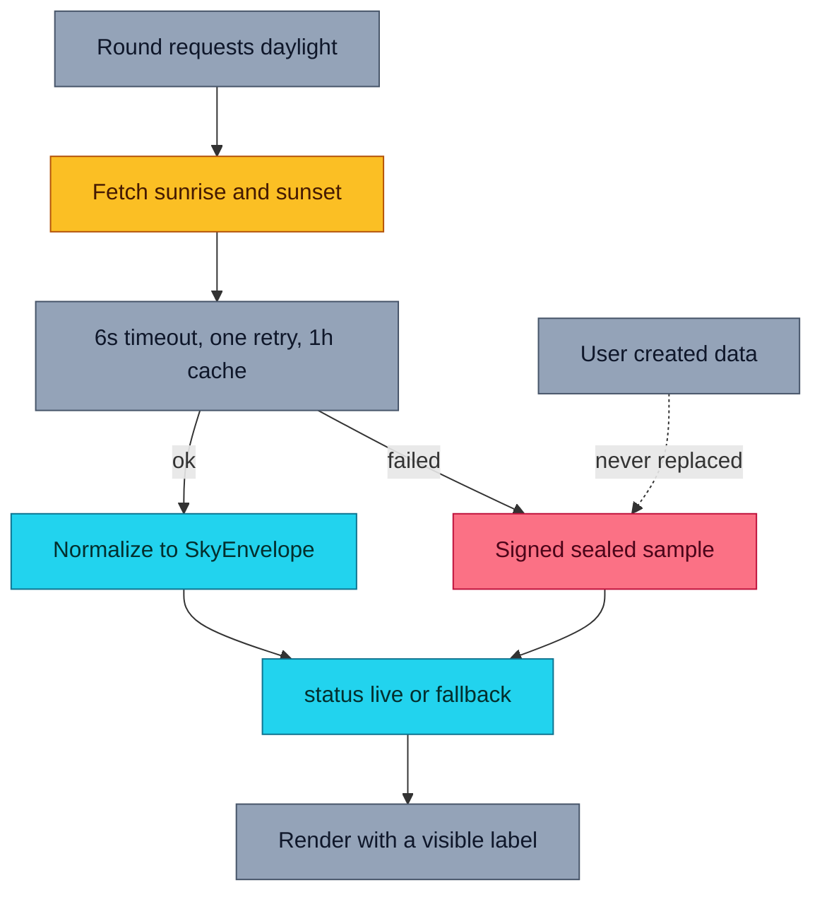
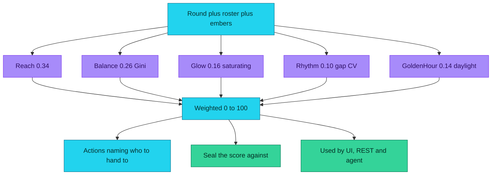
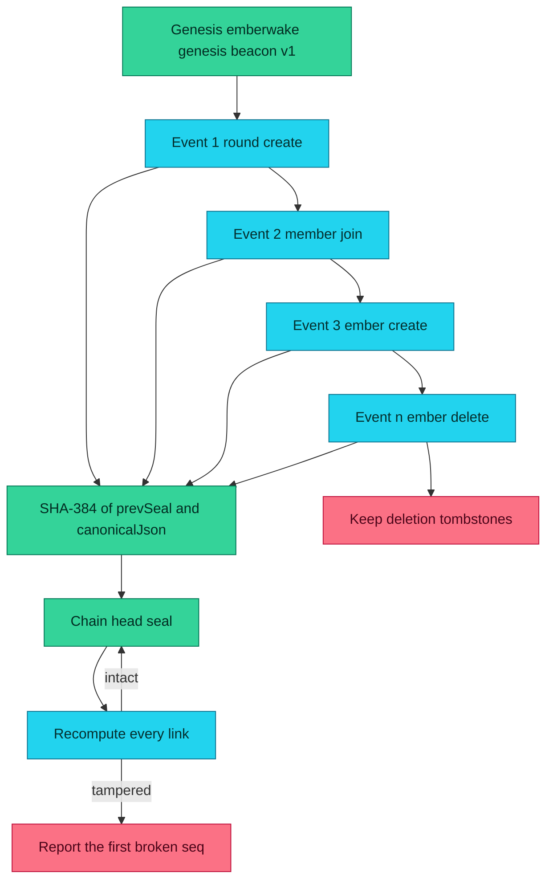
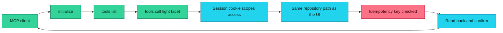
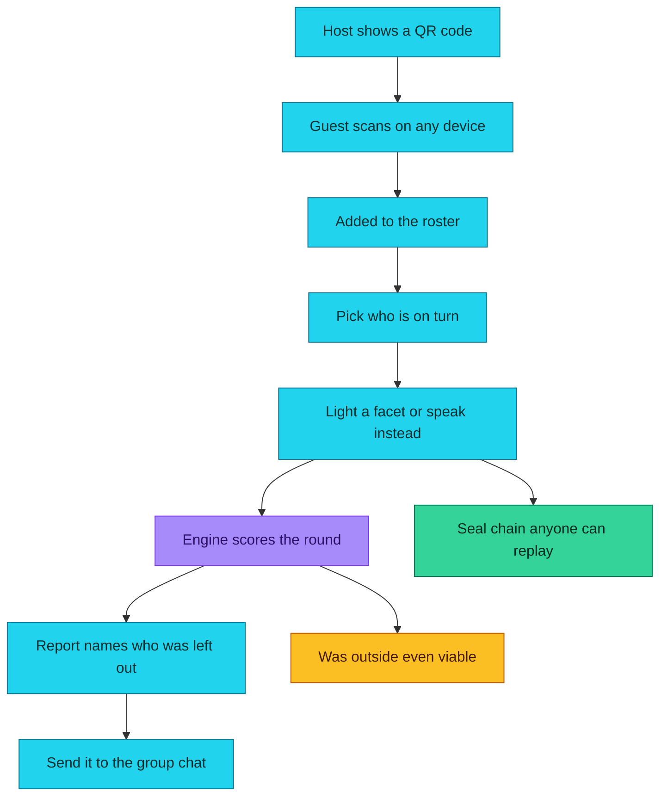
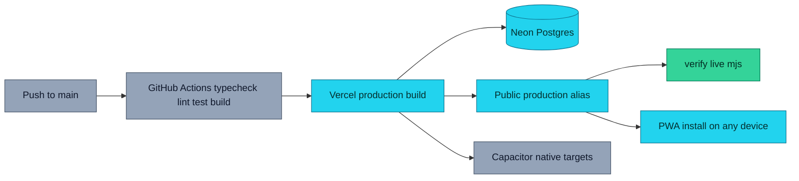
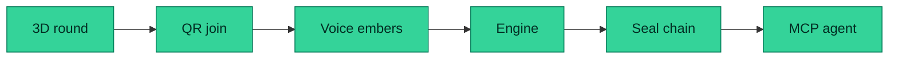
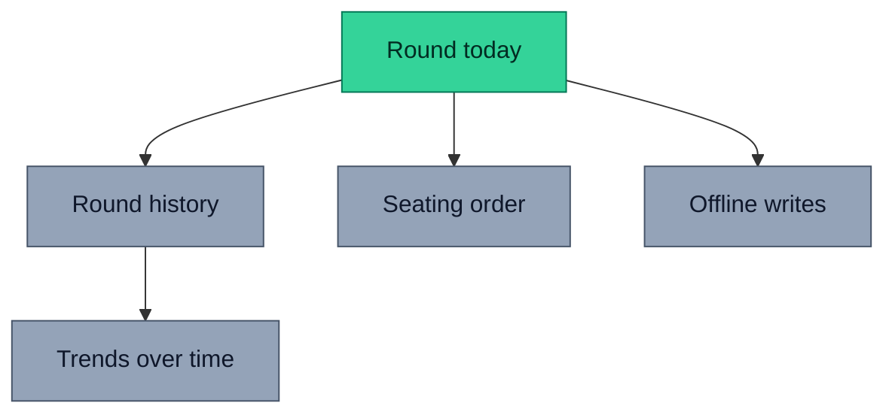
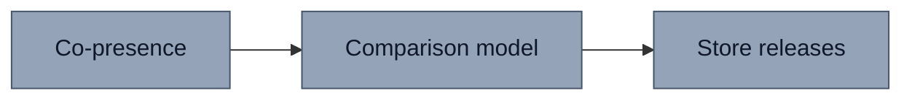

<div align="center">

# Emberwake

### The beacon's shape *is* the fairness metric.

**A 3D beacon game for a real family, where the geometry you can see is generated from the same numbers the report prints.**

[Live app](https://emberwake.vercel.app) · [Source](https://github.com/aniruddhaadak80/emberwake) · [API](https://emberwake.vercel.app/api/health) · [Agent](https://emberwake.vercel.app/agent) · [Issues](https://github.com/aniruddhaadak80/emberwake/issues)

[](https://emberwake.vercel.app)
[](https://www.typescriptlang.org/)
[](https://nextjs.org)
[](#install-on-everything)
[](#-agent-interface)
[](https://huggingface.co/onnx-community/whisper-tiny.en)
[](https://open-meteo.com)
[](LICENSE)

</div>

---

## The problem nobody writes down

Family game night has a pattern, and nobody can prove it.

The same two people take most of the turns. Somebody has to explain the rules, so somebody always plays. The quiet person at the table quietly stops enjoying it. And because nobody wrote down who played, **the exact same round happens again next week with the exact same imbalance.**

Emberwake makes that measurable. Every member gets a **Spark** on a 3D headland. Lighting the shared **Beacon** is a turn-based cooperative round. The beacon's twelve facets are rendered from the *same per-facet fuel array* that produces the numbers in the report — so an unfair split cannot hide behind a good-looking render. If the tower looks lopsided, the fuel genuinely is lopsided, because they are the same array.

Then a deterministic engine tells you **who never played**, and the daylight window tells you whether playing outside was ever a good idea.

> **Built for a Friend.** This was made for one real thing: a family that keeps having the same game night and keeps getting the same result. The challenge theme for this project was *Build for a Friend*, and the honest answer was that the friend was my own family.

---

## ✨ Features

| | What you get |
|---|---|
| **A game you can actually play** | Turn-based, cooperative, twelve facets, short enough for a living room. Not a demo loop — a real round with real turns. |
| **Fairness you can *see*** | Beacon geometry is generated from the same `facets` array the report prints. Unlit facets are physically recessed, leaving real gaps in the tower. |
| **Voice that needs no typing** | Anyone can record a voice ember instead. `whisper-tiny.en` runs **in the browser** via WebAssembly/WebGPU. Audio is never uploaded. |
| **One QR code, every device** | Scan and you are on the roster. No account, no install, no app store. Works on Android, iPhone, Windows, Mac and any browser. |
| **A report worth sending** | Plain text you can paste straight into a family group chat, a JSON download, and a seal chain anyone can replay. |
| **Real sunlight** | Sunrise and sunset for your actual place and date from Open-Meteo, **no API key**. It tells you whether outside was ever viable. |
| **An agent interface** | A live MCP JSON-RPC 2.0 endpoint with seven typed tools, including idempotent mutations on the same code path the UI uses. |
| **Auditable by construction** | Every change appends to a SHA-384 hash chain. Edit a row directly in the database and replay tells you exactly which event broke. |
| **Nothing leaves the phone** | No accounts, no credential to leak, no audio upload, no analytics. Anonymous HTTP-only session cookie. |

---

## 🚀 Quickstart

**There are no required environment variables.** The local adapter embeds Postgres, creates its own schema, and seeds a labelled demo round on first request.

```bash
git clone https://github.com/aniruddhaadak80/emberwake.git
cd emberwake
pnpm install          # or: npm install
pnpm dev              # or: npm run dev
```

Open <http://localhost:3000>. The landing page analyses the seeded demo round for real — two people on that roster never lit a facet, and you can see the gaps in the tower.

### Quality commands

```bash
npm run typecheck   # tsc --noEmit
npm run lint        # eslint
npm run test        # vitest — 66 deterministic tests
npm run build       # production build
npm run verify:live # 135 real HTTP checks against a running deployment
```

### Install on everything

The verified artefact is a **Progressive Web App**. Scanning the QR code on the landing page opens it, and every platform below can install it:

| Platform | How |
| --- | --- |
| Android | Chrome menu → *Install app* |
| iPhone / iPad | Safari → *Share* → *Add to Home Screen* |
| Windows / Mac / Linux | install icon in the address bar |
| Any browser | just open the link |

**Native store builds.** This repository ships a real [Capacitor](https://capacitorjs.com) configuration, so the same web build wraps into native applications:

```bash
npm run build
npx cap add android   # requires Android Studio + JDK 17
npx cap add ios       # requires Xcode on macOS
npx cap add electron  # optional Windows / macOS desktop
npx cap sync
```

To be explicit: **no store binary is published from this repository.** The config and commands are real; producing and submitting binaries needs toolchains that were not available where this was built. The PWA above is the path we actually verified end to end.

### Production environment variables

Only one variable is needed, and only for a deployment:

| Variable | Required | Purpose |
| --- | --- | --- |
| `DATABASE_URL` | **in production** | Hosted Postgres. A production build without it reports `degraded` on `/api/health` rather than silently writing to a local file. |
| `NEXT_PUBLIC_SITE_URL` | no | Canonical origin for metadata and QR codes. Defaults to `https://emberwake.vercel.app`. |

There is **no API key**. Open-Meteo needs none, and Whisper runs client-side.

---

## 📁 Project map

### User routes

| Route | Goal | Persists? |
| --- | --- | --- |
| `/` | Product entry, live demo round analysed server-side, install QR | reads |
| `/round` | Your rounds; create a round; URL-state status filter | `POST /api/rounds` |
| `/round/[id]` | Play: 3D arena, light facets, voice embers, QR invite, delete | `POST/DELETE` embers, `PATCH` round |
| `/round/[id]?as=<memberId>` | The same round with a player pre-selected — the "pass the phone" link | reads |
| `/join/[code]` | Where a QR code lands. Join a round by typing a name | `POST …/members` |
| `/embers` | Every contribution and transcript, in order, with provenance | reads |
| `/report` | The takeaway artifact: who played, who did not, export | reads |
| `/agent` | Live MCP console — real JSON-RPC, one-click calls, raw payloads | via `/api/mcp` |
| `/verify` | Replay the seal chain, report the first broken link | reads |
| `/settings` | Runtime status: datastore, engine version, tool count, daylight | reads |

### API routes

| Route | Methods | Purpose |
| --- | --- | --- |
| `/api/health` | `GET` | Real datastore round-trip; names the adapter |
| `/api/rounds` | `GET`, `POST` | List (paginated, filterable) and create |
| `/api/rounds/[id]` | `GET`, `PATCH`, `DELETE` | Read, update, soft-delete (join-code confirmed) |
| `/api/rounds/[id]/embers` | `GET`, `POST` | List and light a facet |
| `/api/rounds/[id]/embers/[emberId]` | `DELETE` | Soft-delete an ember |
| `/api/rounds/[id]/members` | `POST`, `DELETE` | Join by **id or join code**; host removes a player |
| `/api/rounds/[id]/analyze` | `POST` | Run the engine; `?record=true` appends an audit event |
| `/api/rounds/[id]/report` | `GET` | JSON report, or `?format=text` for download |
| `/api/rounds/[id]/verify` | `GET` | Chain replay + recent sealed events |
| `/api/sky` | `GET` | Normalized Open-Meteo daylight; `?q=` geocodes a place |
| `/api/demo` | `GET` | The seeded, clearly-labelled demo round |
| `/api/join/[code]` | `GET` | Minimal round info for a scanned code |
| `/api/mcp` | `GET`, `POST` | MCP discovery document; JSON-RPC 2.0 endpoint |

### Library

| Module | Responsibility |
| --- | --- |
| `src/lib/engine/beacon-engine.ts` | The five-factor deterministic scorer. Pure. |
| `src/lib/integrity/seal.ts` | Canonical JSON, SHA-384 chaining, replay. |
| `src/lib/db/` | Schema, repository, seed, and the Neon/PGlite adapter choice. |
| `src/lib/sky.ts` | Open-Meteo client with timeout, retry, cache and sealed fallback. |
| `src/lib/sun.ts` | Daylight model: real sunrise/sunset → scene lighting. |
| `src/lib/transcribe.ts` | On-device Whisper loading and decoding. |
| `src/lib/mcp.ts` | Tool schemas, dispatch, idempotency. |
| `src/lib/report.ts` | Report payload + plain-text renderer. |

---

## 🔌 API

Create a round, contribute, read back:

```bash
BASE=https://emberwake.vercel.app

# Create. The response sets an anonymous session cookie — keep it.
curl -s -c jar.txt -X POST "$BASE/api/rounds" \
  -H 'content-type: application/json' \
  -d '{"title":"Diwali Thursday","placeLabel":"Kolkata",
       "latitude":22.56263,"longitude":88.36304,
       "scheduledDate":"2026-10-18"}'
# → { "round": { "id": "…", "joinCode": "D7NEWW", … }, "seal": "…" }

# Add two players.
curl -s -b jar.txt -c jar.txt -X POST "$BASE/api/rounds/$ID/members" \
  -H 'content-type: application/json' \
  -d '{"displayName":"Priya","ageBand":"adult"}'

# Light a facet. Facets are 0–11, weight is 1–5.
curl -s -b jar.txt -X POST "$BASE/api/rounds/$ID/embers" \
  -H 'content-type: application/json' \
  -d '{"memberId":"'$MEMBER'","kind":"spark","weight":4,"facet":0}'

# Run the engine.
curl -s -b jar.txt -X POST "$BASE/api/rounds/$ID/analyze"
# → { "result": { "version": "beacon-engine-v2026.10.1",
#                  "overall": 71.4, "factors": [ …5 items with evidence… ],
#                  "recommendation": { "headline": "2 people were left out (67% reach)",
#                                      "actions": [ … ] } }, "seal": "…" }

# Read the report back as pasteable text.
curl -s -b jar.txt "$BASE/api/rounds/$ID/report?format=text"

# Replay the seal chain.
curl -s -b jar.txt "$BASE/api/rounds/$ID/verify"
# → { "replay": { "ok": true, "events": 14, "head": "…96 hex chars…" } }

# Delete. Requires the join code as confirmation.
curl -s -b jar.txt -X DELETE "$BASE/api/rounds/$ID" \
  -H "x-emberwake-confirm: D7NEWW"
```

Errors always use one envelope, and never leak a stack trace or a connection string:

```json
{ "error": { "code": "unprocessable",
             "message": "That member is not on this round's roster.",
             "fields": { "memberId": "Add the person to the roster first." } } }
```

---

## 🤖 Agent interface

A live MCP-compatible JSON-RPC 2.0 endpoint at **`/api/mcp`**, discoverable via [`public/mcp.json`](public/mcp.json).

```bash
BASE=https://emberwake.vercel.app

curl -s -X POST "$BASE/api/mcp" -H 'content-type: application/json' \
  -d '{"jsonrpc":"2.0","id":1,"method":"initialize","params":{}}'

curl -s -X POST "$BASE/api/mcp" -H 'content-type: application/json' \
  -d '{"jsonrpc":"2.0","id":2,"method":"tools/list","params":{}}'
```

| Tool | Kind | What it does |
| --- | --- | --- |
| `list_rounds` | read | Your rounds, newest first |
| `get_round_analysis` | analysis | The versioned, itemized fairness result |
| `get_round_report` | read | Full report, JSON or pasteable text |
| `verify_integrity` | read | Replay the chain, report the first break |
| `light_facet` | **mutating** | Add an ember — same code path as the UI |
| `add_player` | **mutating** | Add someone to the roster |
| `delete_round` | **mutating** | Soft delete; requires the join code |

Two properties make the agent surface trustworthy rather than decorative:

- **Every tool calls the same repository functions as the UI.** `light_facet` and the on-screen *Light* control are the same mutation.
- **Mutations accept `idempotencyKey`.** Replaying a key returns the original result instead of writing twice, so an agent can safely retry. The key is stored *inside* the audit event payload, which means the replay guard is itself covered by the hash chain.

```bash
# Safe to retry: the second call returns {"replayed": true} and writes nothing.
for i in 1 2; do
  curl -s -X POST "$BASE/api/mcp" -H 'content-type: application/json' \
    -d '{"jsonrpc":"2.0","id":1,"method":"tools/call","params":{
          "name":"light_facet","arguments":{
            "roundId":"'$ID'","memberId":"'$MEMBER'","facet":3,
            "idempotencyKey":"tonight-round-1-turn-7"}}}'
done
```

---

## 🏗 Architecture



### Data pipeline and honest fallback



The fallback is a dated sample, always labelled `offline sample`, and it can never overwrite anything a person actually did.

### The deterministic engine



The same pure function serves the 3D HUD, `POST /api/rounds/[id]/analyze`, and the agent's `get_round_analysis`. A disagreement between two surfaces would be a rendering bug, never a forked formula.

| Factor | Weight | Definition |
| --- | --- | --- |
| **Reach** | 0.34 | Share of the *roster* who lit at least one facet. Computed against the roster, never against embers — otherwise "somebody never played" is uncomputable. |
| **Balance** | 0.26 | `1 − Gini(fuel per member)`. Zero total fuel scores **0**, not a perfect score. |
| **Glow** | 0.16 | `2f / (f + target)` — a rational saturating curve that lands exactly on 1.0 at target fuel. |
| **Rhythm** | 0.10 | `1 − CV(inter-arrival gaps)`. Measures whether turns were *interleaved*, not how fast the round went. Fewer than three contributions is honestly reported as unmeasured. |
| **Golden hour** | 0.14 | Usable daylight minutes for the real planned date, saturating at 60 minutes. |

### Integrity and replay



```
seal_n = SHA-384( UTF-8(prevSeal) || canonicalJson(event_n) )
```

Canonical JSON recursively sorts object keys by UTF-16 code unit and preserves array order, so the same logical event always produces identical bytes regardless of the order a client sent the fields. `prevSeal` is hashed as UTF-8 immediately followed by the payload bytes, exactly as written above.

### Agent sequence



### User journey



### Deployment



---

## 🔐 Security and privacy model

- **No accounts.** Ownership is an unguessable 32-byte scope in an HTTP-only, `SameSite=Lax` cookie, `Secure` in production. There is no credential to leak.
- **Two capabilities, deliberately separate.** The **host** owns a round and can change or delete it. Someone who scanned the QR is a **player**: they may read the round and light facets, but cannot rename it, remove people, delete it, or append audit events. Without this split, the QR would let someone join and then be unable to take a turn.
- **Destructive operations need the join code.** `DELETE` requires `x-emberwake-confirm: <joinCode>`. Knowing a round UUID is not enough to destroy a round.
- **Unguessable ids are not authorization.** Rounds and members are UUIDs, but every read is filtered by scope, so ids cannot be enumerated.
- **All input validated** with Zod before it reaches the database: string lengths, enum membership, numeric ranges, facet bounds, body size caps.
- **All SQL is parameterized.** No string interpolation of user input into any statement.
- **Errors are sanitized.** The client receives a stable envelope; the underlying error is logged server-side only, because it may carry a connection string or a SQL fragment.
- **Voice stays on device.** Audio is never uploaded, and no inference server is involved.
- **Abuse control is best-effort.** Anonymous write rate limiting is an in-memory fixed window. On serverless this is per-instance and not a real defence against a determined attacker; a hosted limiter at the edge would be required. This is stated plainly rather than implied to be more than it is.

---

## 🧪 Testing

```
Test Files  3 passed
     Tests  66 passed
```

Coverage is deliberately concentrated where correctness actually matters:

- **Engine** — normal operation, single-member and single-ember boundaries, empty roster, malformed timestamps, out-of-range facets and absurd weights, and a determinism group that proves order-independence and that the injected clock cannot leak into the maths.
- **Integrity** — canonical JSON key sorting, array-order preservation, `−0` normalization, rejection of non-finite numbers, a seal checked against an **independently implemented** oracle of the documented formula, tamper detection naming the exact broken event, and tombstone counting.
- **Daylight** — night below the horizon, noon at its peak, azimuth sweeping east to west, `dusk` labelled correctly on the evening side, and altitude bounded across every minute of the day.

The engine test group found two real defects during development: a 100× scale error in the overall score, and evening hours mislabelled as `dawn`.

---

## 🗺️ Roadmap

### Now — shipped

- [x] Playable 3D beacon round with per-facet geometry driven by real data
- [x] QR join with no install, no account, host/player capability split
- [x] On-device Whisper voice embers with a typed alternative that always works
- [x] Five-factor deterministic engine, itemized with evidence
- [x] SHA-384 audit chain with replay and tamper detection
- [x] Seven-tool MCP endpoint with idempotent mutations
- [x] Pasteable report, downloadable, with provenance and disclaimer
- [x] PWA install plus Capacitor configuration for native targets



### Next — not built

- [ ] **Round history across sessions.** Today a round is bound to one browser cookie, so clearing cookies loses your own rounds. Export-then-reclaim would fix that without adding accounts.
- [ ] **Hand-picked seating.** Let a host choose the turn order so the person who usually gets skipped goes first by default.
- [ ] **More than one beacon.** A family that plays weekly needs a trend, not just one round.
- [ ] **Offline play with later reconciliation.** The shell is cached today; writes would queue locally and merge on reconnect.



### Later — speculative

- [ ] **Live co-presence** so everyone sees the same beacon light up at once, rather than each device re-reading on its turn.
- [ ] **A second deterministic model** for comparing who improved between rounds, keeping the current engine as the baseline.
- [ ] **Native store releases** once toolchains are available; the PWA remains the supported path until then.



---

## 📜 Data and attribution

- **Sunrise, sunset and place names** — [Open-Meteo](https://open-meteo.com), CC BY 4.0. No API key.
- **Speech to text** — [`onnx-community/whisper-tiny.en`](https://huggingface.co/onnx-community/whisper-tiny.en) via [Transformers.js](https://github.com/huggingface/transformers.js), downloaded and executed in the player's browser.
- **Icons and the Open Graph image** — generated procedurally by `scripts/gen-assets.mjs`, so there are no unattributed third-party assets in this repository.

**Disclaimer.** Emberwake is a family game. It reports how people spent time together. It is not medical, psychological, legal or financial advice, and a low Balance score is an observation about one evening — not about anybody.

---

## 🤝 Contributing

Contributions are genuinely welcome, and the fairness engine is the part most worth arguing with.

```bash
git clone https://github.com/aniruddhaadak80/emberwake.git
cd emberwake && pnpm install && pnpm dev
```

Before opening a pull request:

```bash
npm run typecheck && npm run lint && npm run test && npm run build
```

If you change the engine, please change its `version` constant and update the tests — the version is returned in every score and is what lets a stored report be interpreted correctly later. See [CONTRIBUTING.md](CONTRIBUTING.md).

## 🔒 Security

Found something? Please read [SECURITY.md](SECURITY.md) before opening a public issue.

## 📄 License

[MIT](LICENSE) © 2026 Aniruddha Adak

Built with [Next.js](https://nextjs.org), [Three.js](https://threejs.org), [Neon](https://neon.tech), [PGlite](https://pglite.dev), [Transformers.js](https://github.com/huggingface/transformers.js) and a lot of care about who actually gets a turn.